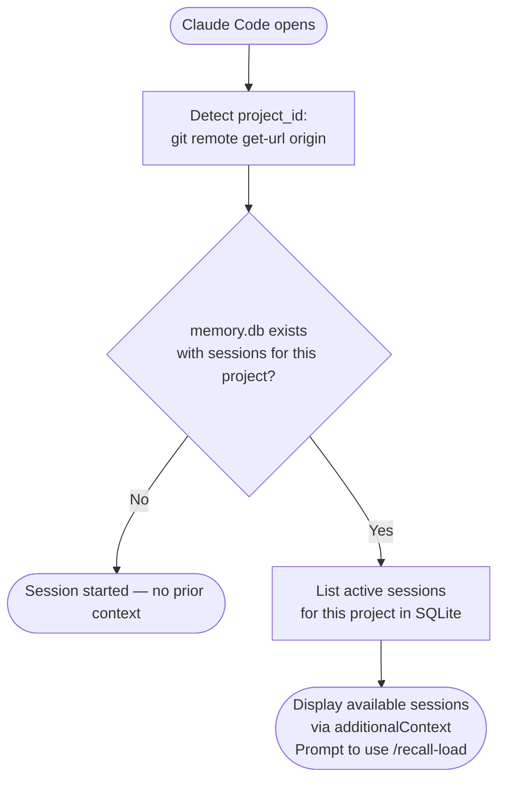
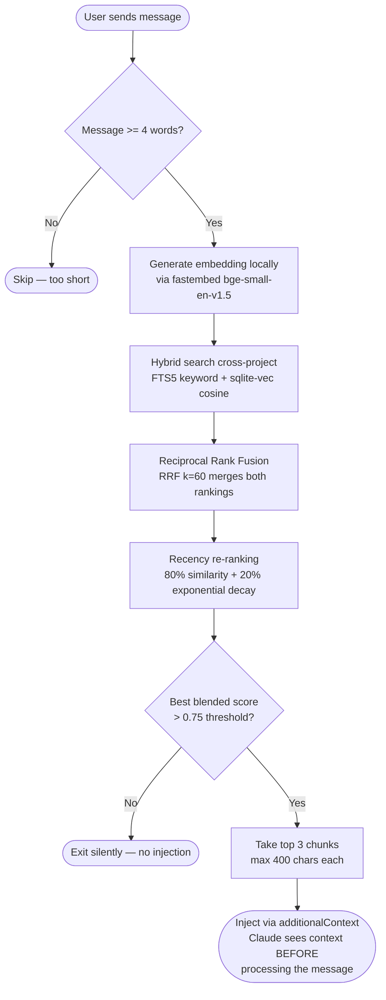
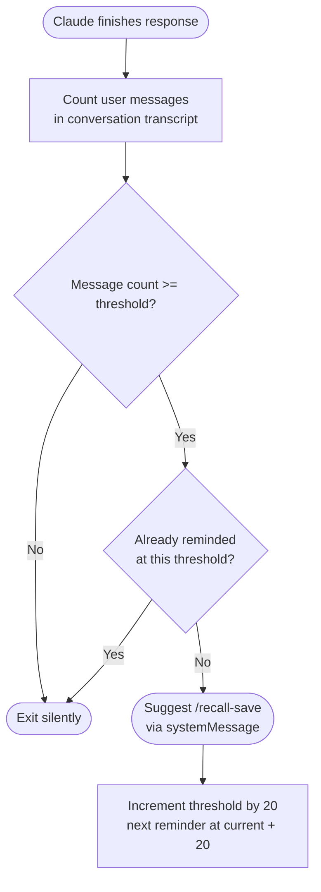
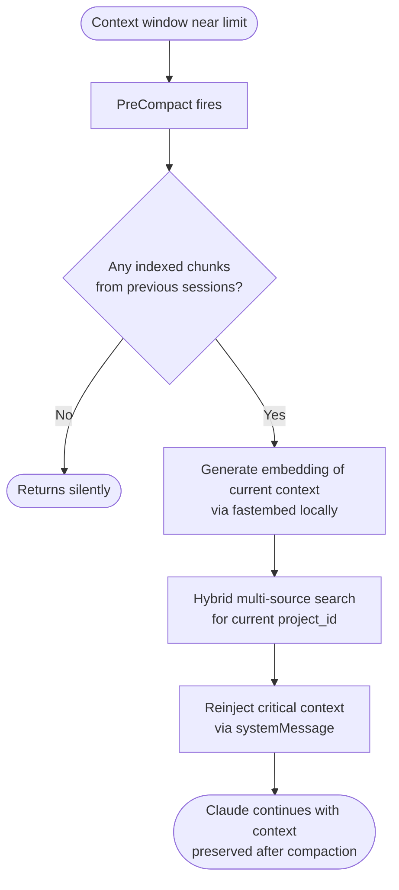
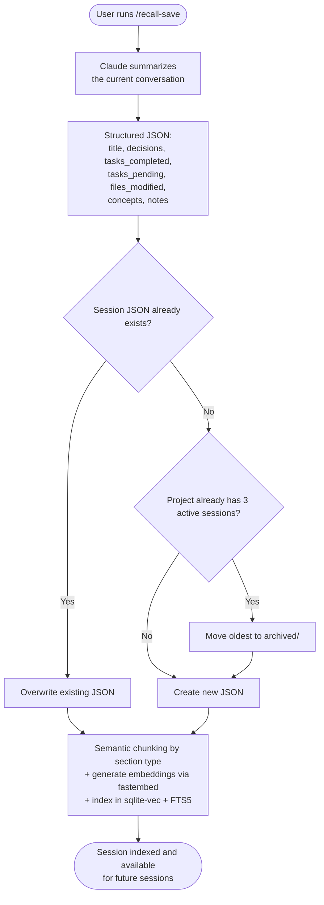
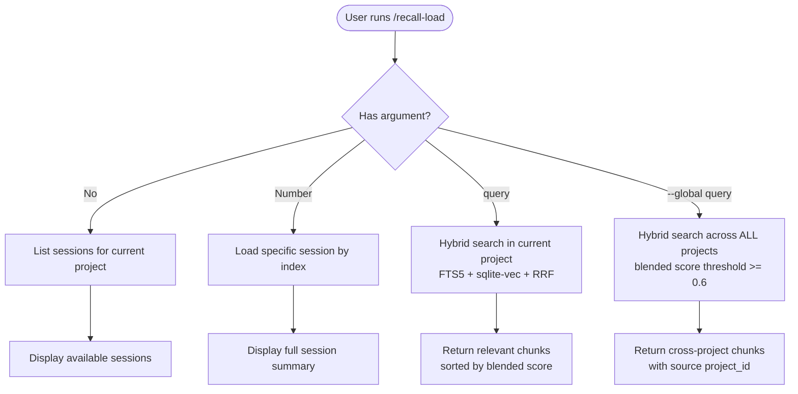
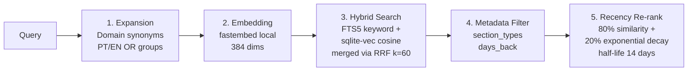
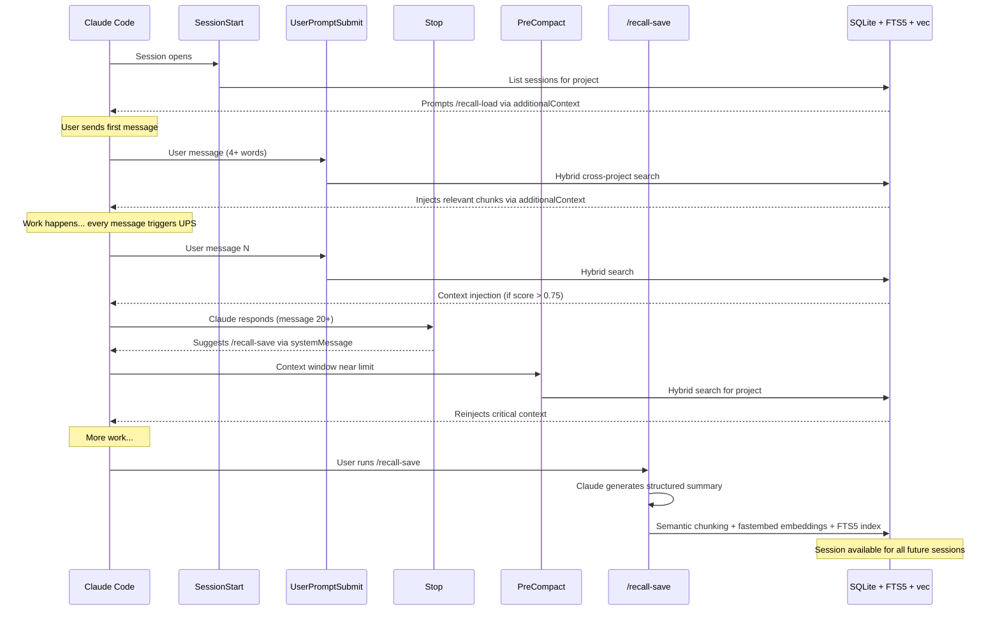

# recall — Technical Flow

Reference document for implementation.

---

## Tech Stack

| Component | Technology |
|-----------|------------|
| Database | SQLite + sqlite-vec + FTS5 |
| Embeddings | Local via fastembed (`BAAI/bge-small-en-v1.5`, 384 dims, ONNX) |
| Session summary | Generated by Claude itself (no external API) |
| Session content | JSON per session (structured by Claude) |
| Search | Hybrid: FTS5 keyword + sqlite-vec cosine via RRF (Reciprocal Rank Fusion) |
| Configuration | Zero config — no API keys required |

---

## File Structure

```
~/.claude/memory/
  memory.db                              ← SQLite + sqlite-vec + FTS5
  cinemetric_2026-03-29.json             ← session source document
  blueprint_2026-03-28.json
  archived/
    demo-script_2026-03-13.json          ← rotated sessions
```

---

## SQLite Schema

```sql
CREATE TABLE sessions (
  id TEXT PRIMARY KEY,           -- Claude Code session_id
  project_id TEXT,               -- git remote origin url
  cwd TEXT,                      -- project directory
  filename TEXT,                 -- corresponding JSON filename
  title TEXT,                    -- one-line summary
  created_at INTEGER,
  archived INTEGER DEFAULT 0
);

CREATE TABLE chunks (
  id INTEGER PRIMARY KEY AUTOINCREMENT,
  session_id TEXT,               -- FK → sessions.id
  content TEXT,                  -- chunk text
  chunk_index INTEGER,
  section_type TEXT DEFAULT NULL  -- decisions, tasks_completed, tasks_pending,
                                 -- files_modified, concepts, notes, unknown
);

CREATE VIRTUAL TABLE chunk_embeddings USING vec0(
  chunk_id INTEGER PRIMARY KEY,
  embedding FLOAT[384]           -- BAAI/bge-small-en-v1.5 via fastembed
);

CREATE VIRTUAL TABLE chunks_fts USING fts5(
  content,                       -- FTS5 full-text index
  content=chunks,                -- external content table
  content_rowid=id
);
```

---

## Four Active Points

```
START              EVERY MESSAGE         LONG SESSION          END (manual)
  │                     │                     │                     │
SessionStart    UserPromptSubmit           Stop              /recall-save
  │                     │                     │                     │
List sessions   Auto hybrid search     Save reminder      Claude summary +
+ prompt        + inject context       at 20, 40, 60...   chunk + embed +
/recall-load    via additionalContext   messages            index locally
```

> **SessionEnd does nothing** — the platform does not pass the transcript, making automatic saving impossible. The only real save flow is manual `/recall-save`.

---

## Detailed Flow

### START — Hook: SessionStart



---

### EVERY MESSAGE — Hook: UserPromptSubmit

**This is the core feature.** Runs on every user message (4+ words), cross-project.



**Key details:**
- Search is always cross-project (`project_id=None`) — finds context from any indexed project
- Query expansion adds domain synonyms PT/EN (e.g., "deploy" → "deploy OR implantação OR deployment")
- FTS5 catches exact keywords, vectors catch semantic equivalents
- Each session gets guaranteed `top_k_per_session=2` slots — large sessions don't drown out smaller ones
- Runs entirely locally (fastembed + SQLite) — sub-100ms latency

---

### LONG SESSION — Hook: Stop



**Thresholds:** First reminder at 20 messages, then 40, 60, 80... Non-blocking, non-intrusive.

---

### CONTEXT PRESERVATION — Hook: PreCompact



---

### END — Command: /recall-save (manual)

The only flow that saves and indexes the session. Must be run before closing.



---

### Command: /recall-load (manual)

Load specific context on demand.



---

## Search Pipeline (5 stages)

Every search — whether from UserPromptSubmit, PreCompact, or /recall-load — goes through the same pipeline:

```
Query → Expansion → Embedding → Hybrid Search → Metadata Filter → Recency Re-rank
```



### Semantic Chunking

Sessions are chunked by logical section, not fixed word count:

| Section | What it captures |
|---------|-----------------|
| `decisions` | Architectural and technical decisions |
| `tasks_completed` | Work done in the session |
| `tasks_pending` | Open work items |
| `concepts` | Key technical concepts discussed |
| `files_modified` | Files changed |
| `notes` | Free-form context |

Each chunk is prefixed with the session title for embedding context.

---

## Full Lifecycle



---

## Summary

| Aspect | Current state |
|--------|---------------|
| Storage | SQLite + sqlite-vec + FTS5 + JSON per session (fallback) |
| Embeddings | Local via fastembed (BAAI/bge-small-en-v1.5, 384 dims, ONNX) |
| Search | Hybrid: FTS5 keyword + sqlite-vec cosine via RRF |
| Query expansion | Domain synonyms PT/EN via OR groups |
| Recency boost | Exponential decay (half-life 14 days), blended 80/20 |
| Semantic chunking | By logical section (decisions, tasks, concepts, notes, files) |
| Cross-project | `project_id=None` — threshold 0.6, sorted by blended score |
| SessionStart | Lists available sessions, prompts `/recall-load` |
| UserPromptSubmit | **Core feature** — auto hybrid search on every message, injects via additionalContext |
| Stop | Save reminder at 20, 40, 60... messages (incremental threshold) |
| PreCompact | Reinjects critical context before compaction |
| SessionEnd | No-op — platform does not pass transcript |
| `/recall-save` | Only save flow — manual, generates summary + indexes locally |
| `/recall-load` | Hybrid search by project or cross-project (`--global`) |
| Session rotation | Max 3 active per project + archived/ |
| API keys required | None — fully local, zero cost |
