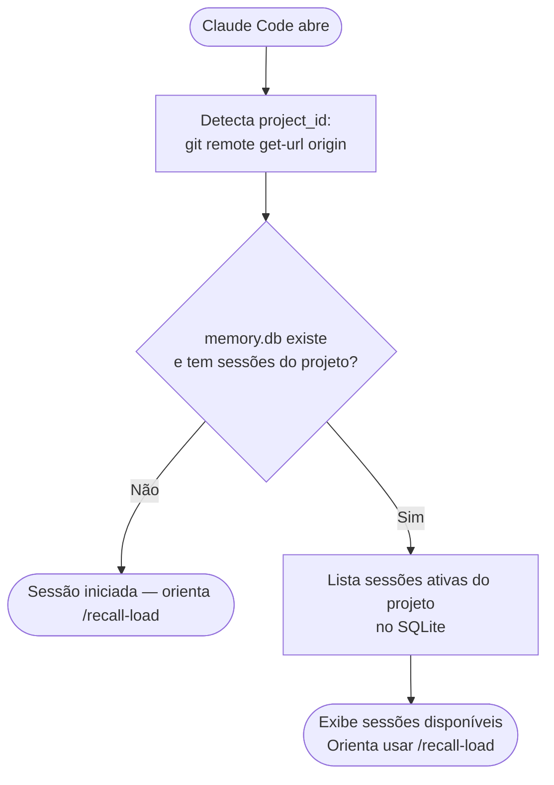
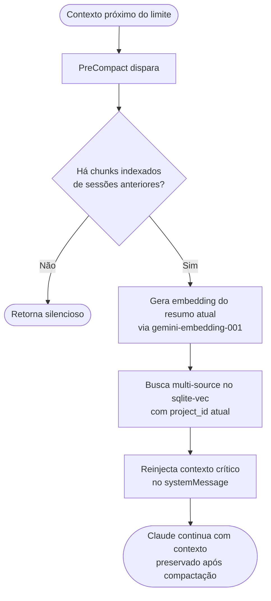
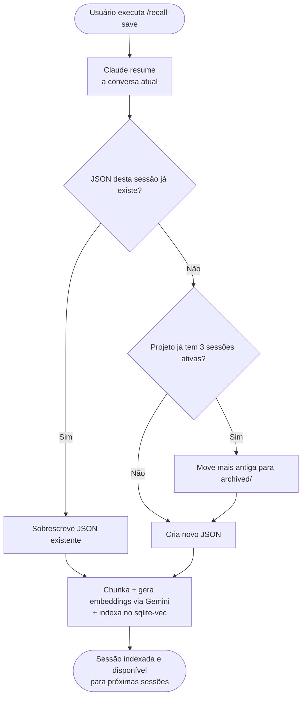
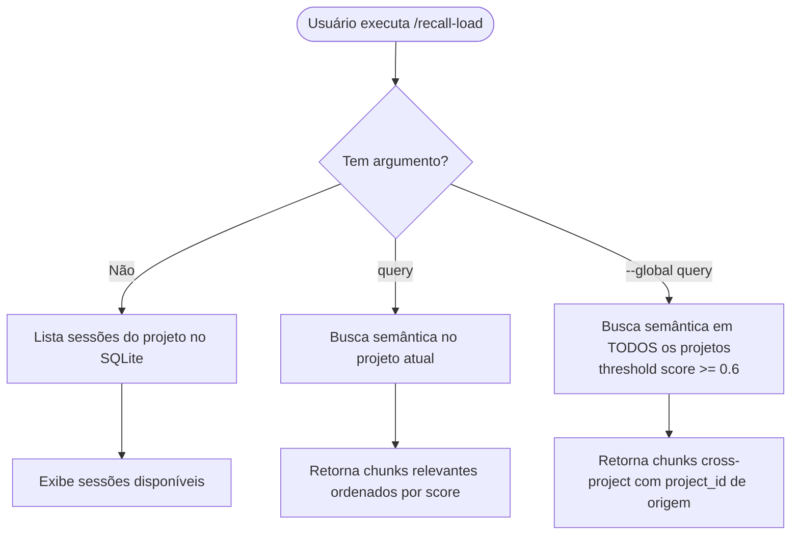
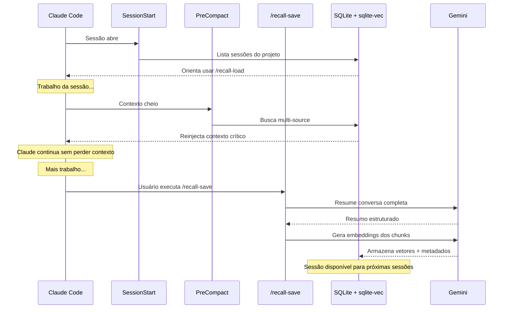

# Fluxo do Plugin recall

Documento de referência para implementação.

---

## Stack Técnica

| Componente | Tecnologia |
|---|---|
| Banco de dados | SQLite + sqlite-vec |
| Embeddings | Gemini `gemini-embedding-001` |
| Resumo de sessão | Gemini Flash |
| Conteúdo das sessões | JSON por sessão (gerado pelo Gemini) |
| Configuração | `GEMINI_API_KEY` no ambiente |

---

## Estrutura de Arquivos

```
~/.claude/memory/
  memory.db                              ← SQLite + sqlite-vec
  demo-script_2026-03-13.json            ← documento fonte da sessão
  blueprint_2026-03-12.json
  api-fast_2026-03-11.json
  archived/
    demo-script_2026-03-01.json          ← sessões antigas
```

---

## Schema SQLite

```sql
-- Índice de sessões
CREATE TABLE sessions (
  id TEXT PRIMARY KEY,           -- sessionId do Claude Code
  project_id TEXT,               -- git remote origin url
  cwd TEXT,                      -- diretório do projeto
  filename TEXT,                 -- nome do JSON correspondente
  title TEXT,                    -- resumo em uma linha
  created_at INTEGER,
  archived INTEGER DEFAULT 0
);

-- Chunks de texto por sessão
CREATE TABLE chunks (
  id INTEGER PRIMARY KEY AUTOINCREMENT,
  session_id TEXT,               -- FK → sessions.id
  content TEXT,                  -- texto do chunk
  chunk_index INTEGER
);

-- Vetores de embedding — sqlite-vec
CREATE VIRTUAL TABLE chunk_embeddings USING vec0(
  chunk_id INTEGER PRIMARY KEY,
  embedding FLOAT[3072]
);
```

---

## Os Dois Pontos Ativos

```
INÍCIO                              FIM (manual)
   │                                    │
SessionStart                      /recall-save
   │                                    │
Lista sessões +              Resume Gemini Flash +
orienta /recall-load         chunka + embeda + indexa
```

> **SessionEnd não faz nada** — a plataforma não passa o transcript, tornando qualquer salvamento automático impossível. O único fluxo real de salvamento é o `/recall-save` manual.

---

## Fluxo Detalhado

### INÍCIO — Hook: SessionStart



---

### MEIO — Hook: PreCompact



---

### FIM — Comando: /recall-save (manual)

O único fluxo que salva e indexa a sessão. Deve ser executado antes de encerrar.



---

### Comando: /recall-load (manual)

Para carregar contexto específico sob demanda.



---

## Ciclo de Vida Completo



---

## Comparativo Final

| Aspecto | Valor atual |
|---|---|
| Armazenamento | SQLite + sqlite-vec + JSON por sessão (fallback) |
| Busca | Multi-source com cota garantida por sessão |
| Busca cross-project | `project_id=None` — threshold 0.6, ordenado por score |
| SessionStart | Lista sessões disponíveis, orienta `/recall-load` |
| PreCompact | Reinjeção de contexto crítico pós-compactação |
| SessionEnd | Sem operação — plataforma não passa transcript |
| `/recall-save` | Único fluxo de salvamento — manual, obrigatório |
| `/recall-load` | Busca semântica por projeto ou cross-project (`--global`) |
| Crescimento | Máx 3 sessões ativas por projeto + archived/ |
