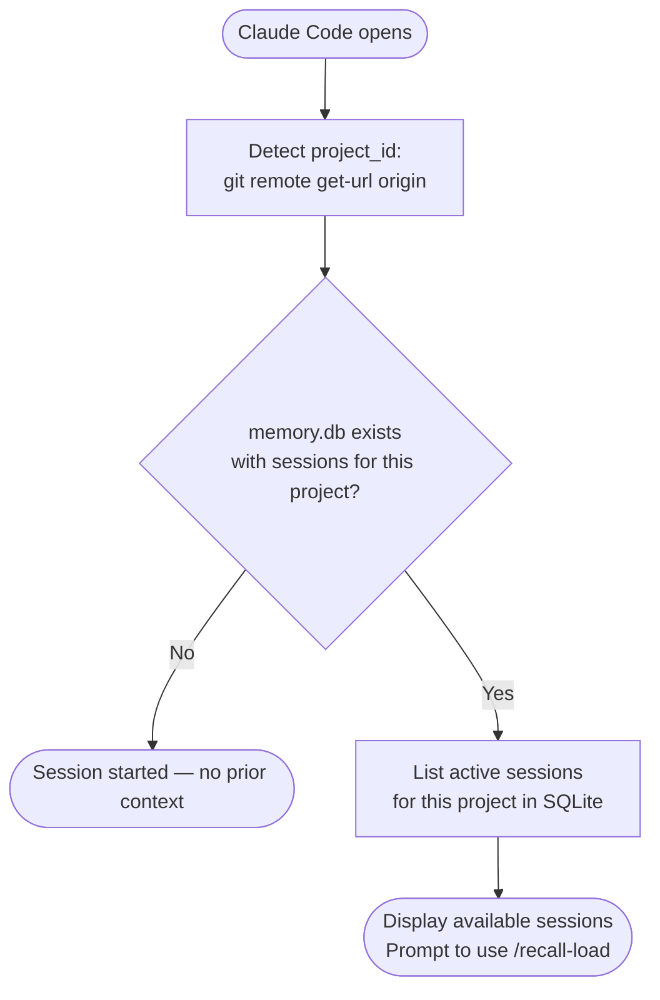
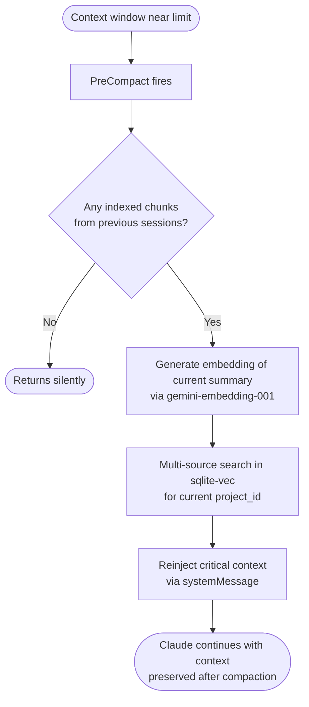
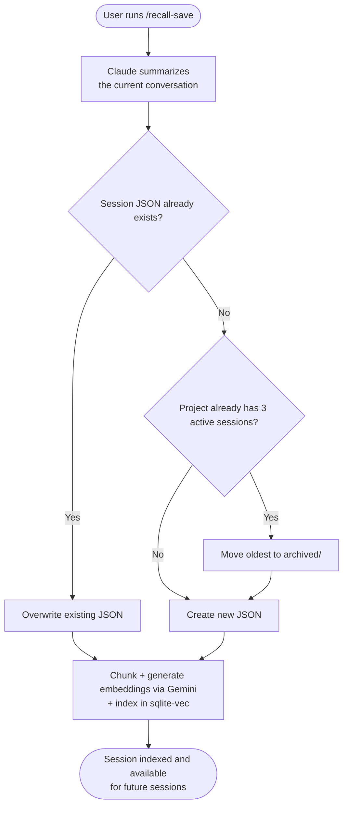
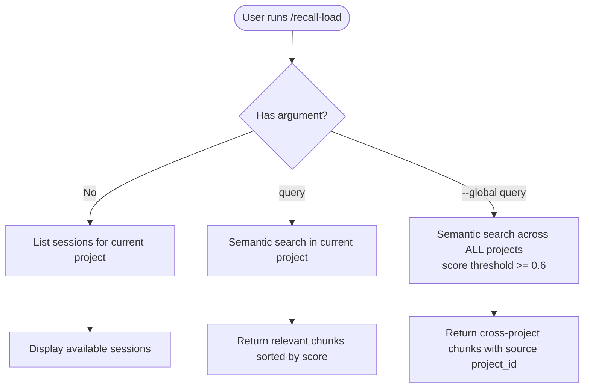
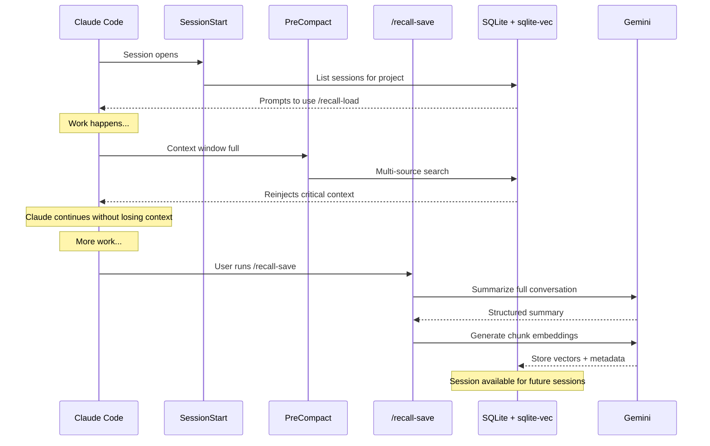

# recall — Technical Flow

Reference document for implementation.

---

## Tech Stack

| Component | Technology |
|-----------|------------|
| Database | SQLite + sqlite-vec |
| Embeddings | Gemini `gemini-embedding-001` |
| Session summary | Gemini Flash |
| Session content | JSON per session (generated by Gemini) |
| Configuration | `GEMINI_API_KEY` in environment |

---

## File Structure

```
~/.claude/memory/
  memory.db                              ← SQLite + sqlite-vec
  demo-script_2026-03-13.json            ← session source document
  blueprint_2026-03-12.json
  archived/
    demo-script_2026-03-01.json          ← rotated sessions
```

---

## SQLite Schema

```sql
CREATE TABLE sessions (
  id TEXT PRIMARY KEY,           -- Claude Code session_id
  project_id TEXT,               -- git remote origin url
  cwd TEXT,                      -- project directory
  filename TEXT,                 -- corresponding JSON filename
  title TEXT,                    -- one-line summary
  created_at INTEGER,
  archived INTEGER DEFAULT 0
);

CREATE TABLE chunks (
  id INTEGER PRIMARY KEY AUTOINCREMENT,
  session_id TEXT,               -- FK → sessions.id
  content TEXT,                  -- chunk text
  chunk_index INTEGER
);

CREATE VIRTUAL TABLE chunk_embeddings USING vec0(
  chunk_id INTEGER PRIMARY KEY,
  embedding FLOAT[3072]
);
```

---

## Two Active Points

```
START                               END (manual)
  │                                     │
SessionStart                      /recall-save
  │                                     │
List sessions +               Gemini Flash summary +
prompt /recall-load           chunk + embed + index
```

> **SessionEnd does nothing** — the platform does not pass the transcript, making automatic saving impossible. The only real save flow is manual `/recall-save`.

---

## Why SessionStart doesn't auto-inject context

The RAG requires a query to search. At the very start of a session — before the user has said anything — there is no context to generate a meaningful query from. Auto-injecting would bring in arbitrary chunks unrelated to what the user actually wants to work on.

**Design decision:** let the user explicitly load context with `/recall-load "specific query"` once they know what they're working on. This is more precise and avoids unnecessary Gemini API calls on every session open.

### Recommended workaround: CLAUDE.md instruction

Claude Code always reads `CLAUDE.md` at the start of every session. You can use this to instruct Claude to run `/recall-load` automatically — effectively replicating auto-injection without the RAG needing a pre-session query.

Add to your project's `CLAUDE.md` (or the global `~/.claude/CLAUDE.md` for all projects):

```markdown
At the start of each session, run /recall-load to check for previous context
before starting any work.
```

For a more targeted approach, instruct Claude to generate the query from the first user message:

```markdown
At the start of each session, analyze the user's first message and run
/recall-load "query" with a 5-10 word semantic query derived from what
they are asking — before responding.
```

This way Claude acts as the orchestrator, bridging the gap between "session just opened" and "meaningful query available".

---

## Detailed Flow

### START — Hook: SessionStart



---

### MIDDLE — Hook: PreCompact



---

### END — Command: /recall-save (manual)

The only flow that saves and indexes the session. Must be run before closing.



---

### Command: /recall-load (manual)

Load specific context on demand.



---

## Full Lifecycle



---

## Summary

| Aspect | Current state |
|--------|---------------|
| Storage | SQLite + sqlite-vec + JSON per session (fallback) |
| Search | Multi-source with guaranteed slots per session |
| Cross-project search | `project_id=None` — threshold 0.6, sorted by score |
| SessionStart | Lists available sessions, prompts `/recall-load` |
| PreCompact | Reinjects critical context before compaction |
| SessionEnd | No-op — platform does not pass transcript |
| `/recall-save` | Only save flow — manual, required |
| `/recall-load` | Semantic search by project or cross-project (`--global`) |
| Session rotation | Max 3 active per project + archived/ |
